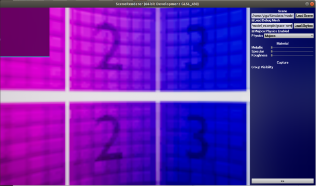
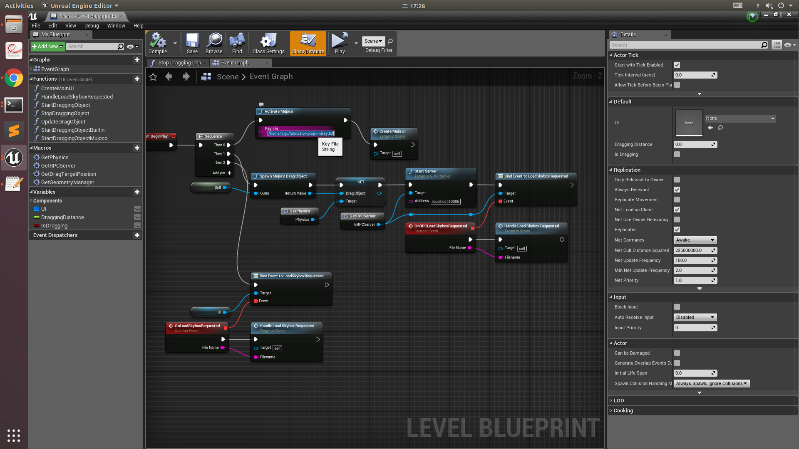

### 安装 Unreal Engine
1. 注册[Epic Games](www.epicgames.com)帐号
2. 用该帐号登入[Unreal Engine](www.unrealengine.com), 进入帐号下的PERSONAL，选择CONNECTED ACCOUNTS, 将github帐号连接上
3. 用github下载源代码安装Unreal Engine, 当前project所用版本为4.20，具体步骤如下：
   ```
   git clone https://github.com/EpicGames/UnrealEngine -b 4.20
   cd UnrealEngine
   ```
4. 修改UnrealEngine/Engine/Source/Programs/UnrealBuildTool/Configuration/ModuleRules.cs 294行

   `
   294:		public bool bUseRTTI = true;
   `
5. 将UnrealEngine/Engine/Source/Runtime/RenderCore/Public的RenderingThread.h， 326行的两个连续逗号间添加`typename`， 如下所示：

   `
   ENQUEUE_UNIQUE_RENDER_COMMAND_ONEPARAMETER_DECLARE_OPTTYPENAME(
   TypeName,ParamType1,ParamName1,ParamValue1,typename,Code)
   `
6. 编译安装
   ```
   ./Setup.sh
   ./GenerateProjectFiles.sh
   make
   ```
   注意： 由于Unreal Engine对RAM要求较高，跑上述代码时最好只开terminal一个窗口，不然容易死机。
 
 ### 编译 Scene Renderer
 在Unreal Engine路径下，
   ```
   cd Engine/Binaries/Linux/
   ./UE4Editor "/home/yigu/Simulator/projs/scene_renderer/scene_renderer.uproject"
   ```
 如果出现存在的.so文件（如: libmujoco150nogl.so）报错说找不到以及iso无法编译，则运行 
 ```
 export PATH=Simulator/projs/scene_renderer/ThirdParty/mujoco/lib
 ```
 将其所在的lib添加到路径中来
 
 ### 运行Scene Renderer
 点击Play，重新设置路径
 
 
 
 可能遇到如下问题:
 1. mjkey.txt很有可能过期了或者不属于运行的电脑，需要去[mujoco](https://www.roboti.us/license.html)官网申请新的license
 2. 报错找不到mjkey.txt, 如下修改成本机mjkey.txt 所在路径
 
    点击 BluePrints -> Open Level Blueprint:
    
    
    
    修改Key File的地址：
    
    
 3. 需要更新protoco:
     1.  从源代码安装 [grpc](https://github.com/grpc/grpc/blob/master/BUILDING.md):
     ```
     git clone -b $(curl -L https://grpc.io/release) https://github.com/grpc/grpc
     cd grpc
     git submodule update --init
     make
     ```
     2. 将Source/scene_renderer/Private/RecompileProto.py 中 Ln118的GRPC_PLUGIN_PATH 和 Ln120的PROTOC 更新成这台电脑上的所在位置
     3. 运行 RecompileProto.py 
     4. 将~/Simulator/projs/dataset_generator中的文件替换成protobuf_py中新生成的SceneRenderer_pb2.py和SceneRenderer_pb2_grpc.py
     5. 将grpc， protobuf升级到最新版
     ```
     pip3 uninstall grpcio
    pip3 uninstall protobuf
    pip3 install --user grpcio
    pip3 install --user protobuf
    ```
    注意要用系统自带的python, 不要用虚拟环境anaconda中的，否则sudo运行会出现问题。
    源代码所用python版本较老，一些包比如scipy的函数可以改成最新版。
### 运行Simulator/projs/dataset_generator/robot_control_kine.py
```
sudo python robot_control_kine.py
```
